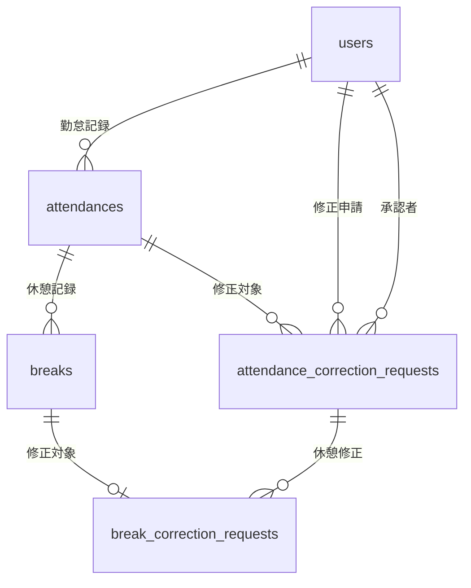

# Atte（勤怠管理システム）

## 使用技術（実行環境）

- PHP 8.2
- Laravel 8.x
- MySQL 8.0
- Nginx 1.20
- Docker / Docker Compose

## テーブル設計

### usersテーブル
| カラム名 | 型 | 制約 | 説明 |
|---------|-----|------|------|
| id | bigint unsigned | PRIMARY KEY | ユーザーID |
| name | varchar(255) | NOT NULL | ユーザー名 |
| email | varchar(255) | UNIQUE, NOT NULL | メールアドレス |
| email_verified_at | timestamp | NULLABLE | メール認証日時 |
| password | varchar(255) | NOT NULL | パスワード |
| role | enum('admin', 'employee') | NOT NULL, DEFAULT 'employee' | ユーザー権限 |
| remember_token | varchar(100) | NULLABLE | ログイン保持トークン |
| created_at | timestamp | - | 作成日時 |
| updated_at | timestamp | - | 更新日時 |

### attendancesテーブル
| カラム名 | 型 | 制約 | 説明 |
|---------|-----|------|------|
| id | bigint unsigned | PRIMARY KEY | 勤怠ID |
| user_id | bigint unsigned | FOREIGN KEY, NOT NULL | ユーザーID |
| date | date | NOT NULL | 勤怠日 |
| clock_in | datetime | NULLABLE | 出勤時刻 |
| clock_out | datetime | NULLABLE | 退勤時刻 |
| note | text | NULLABLE | 備考 |
| status | enum('working', 'on_break', 'finished') | NULLABLE | 勤務状態 |
| is_corrected | boolean | DEFAULT false | 修正済みフラグ |
| corrected_at | datetime | NULLABLE | 修正日時 |
| created_at | timestamp | - | 作成日時 |
| updated_at | timestamp | - | 更新日時 |

**制約:**
- UNIQUE(user_id, date) - 1日1レコード

### breaksテーブル
| カラム名 | 型 | 制約 | 説明 |
|---------|-----|------|------|
| id | bigint unsigned | PRIMARY KEY | 休憩ID |
| attendance_id | bigint unsigned | FOREIGN KEY, NOT NULL | 勤怠ID |
| break_start | datetime | NOT NULL | 休憩開始時刻 |
| break_end | datetime | NULLABLE | 休憩終了時刻 |
| created_at | timestamp | - | 作成日時 |
| updated_at | timestamp | - | 更新日時 |

### attendance_correction_requestsテーブル
| カラム名 | 型 | 制約 | 説明 |
|---------|-----|------|------|
| id | bigint unsigned | PRIMARY KEY | 修正申請ID |
| attendance_id | bigint unsigned | FOREIGN KEY, NOT NULL | 勤怠ID |
| user_id | bigint unsigned | FOREIGN KEY, NOT NULL | 申請者ID |
| requested_clock_in | datetime | NULLABLE | 修正後出勤時刻 |
| requested_clock_out | datetime | NULLABLE | 修正後退勤時刻 |
| reason | text | NOT NULL | 申請理由 |
| status | enum('pending', 'approved', 'rejected') | DEFAULT 'pending' | 承認状態 |
| approved_by | bigint unsigned | FOREIGN KEY, NULLABLE | 承認者ID |
| approved_at | datetime | NULLABLE | 承認日時 |
| created_at | timestamp | - | 作成日時 |
| updated_at | timestamp | - | 更新日時 |

### break_correction_requestsテーブル
| カラム名 | 型 | 制約 | 説明 |
|---------|-----|------|------|
| id | bigint unsigned | PRIMARY KEY | 休憩修正ID |
| correction_request_id | bigint unsigned | FOREIGN KEY, NOT NULL | 修正申請ID |
| break_id | bigint unsigned | FOREIGN KEY, NULLABLE | 休憩ID |
| requested_break_start | datetime | NOT NULL | 修正後休憩開始 |
| requested_break_end | datetime | NULLABLE | 修正後休憩終了 |
| created_at | timestamp | - | 作成日時 |
| updated_at | timestamp | - | 更新日時 |

## ER図



## 環境構築

### 必要な環境
- Docker
- Docker Compose

### セットアップ手順

1. リポジトリのクローン
```bash
git clone <repository-url>
cd Attendance-management
```

2. Dockerコンテナの起動
```bash
docker compose up -d --build
```

3. PHPコンテナに入る
```bash
docker compose exec php bash
```

4. Composerで依存パッケージをインストール
```bash
composer install
```

5. 環境変数ファイルの作成
```bash
cp .env.example .env
```

6. アプリケーションキーの生成
```bash
php artisan key:generate
```

7. データベースのマイグレーション実行
```bash
php artisan migrate
```

8. シーダーの実行（テストユーザー・サンプルデータ）
```bash
php artisan db:seed
```

9. ブラウザで http://localhost にアクセス

## アクセス情報

### アプリケーション
- URL: http://localhost

### 管理ツール
- phpMyAdmin: http://localhost:8080
  - ユーザー名: laravel_user
  - パスワード: laravel_pass

- MailHog（メール確認）: http://localhost:8025

## テストアカウント

### 管理者
- メールアドレス: admin@example.com
- パスワード: password123

### 一般ユーザー（テスト用）
- メールアドレス: user@example.com
- パスワード: password123

### 従業員アカウント（シーダーで作成）
以下のアカウントでログイン可能です（パスワードは全て `password123`）:
- yamada@example.com（山田 太郎）
- sato@example.com（佐藤 花子）
- suzuki@example.com（鈴木 一郎）
- tanaka@example.com（田中 美咲）
- takahashi@example.com（高橋 健太）

## 主な機能

### 一般ユーザー機能
- 勤怠打刻（出勤/退勤/休憩入/休憩戻）
- 勤怠履歴の閲覧
- 勤怠修正申請
- 申請状況の確認

### 管理者機能
- スタッフ一覧・勤怠一覧の閲覧
- 日付別勤怠一覧の閲覧
- 勤怠修正申請の承認/却下

### 認証機能
- 会員登録
- ログイン/ログアウト
- メール認証

## テストの実行

```bash
# コンテナ内で実行
php artisan test

# または、特定のテストのみ実行
php artisan test --filter=LoginTest
```

## メール認証の確認方法

1. 会員登録を行う
2. ブラウザで http://localhost:8025 にアクセス（MailHog）
3. 受信したメールから認証リンクをクリック
4. 認証完了後、勤怠画面にアクセス可能

## その他

### 注意事項
- 本番環境では必ず環境変数を適切に設定してください
- メール送信はMailHog（開発用SMTPサーバー）を使用しています
- シーダー実行で自動的にサンプルデータが作成されます

### データベースのリセット

データベースを初期状態に戻す場合:
```bash
php artisan migrate:fresh --seed
```
